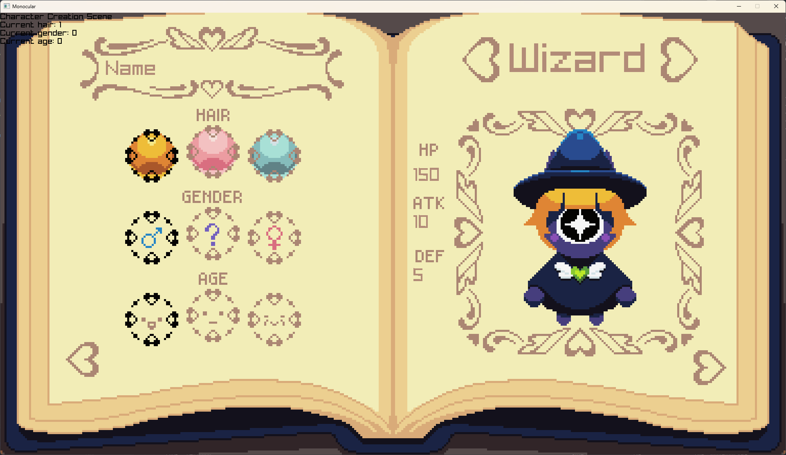
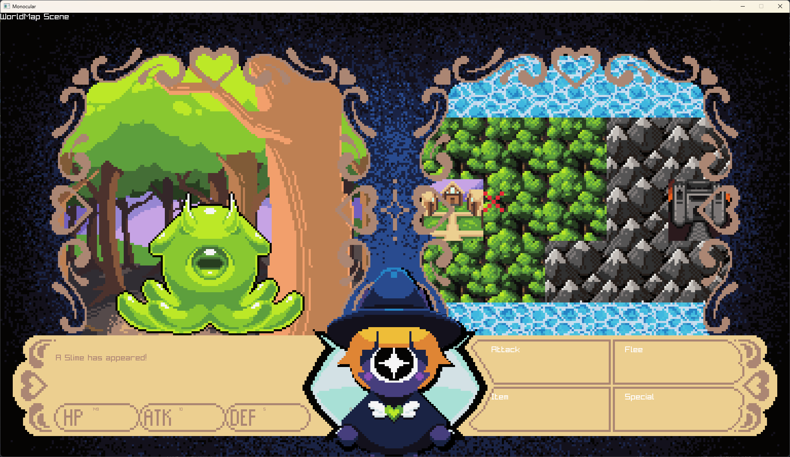

# Ocular

This is an RPG I made originally for my C#'s class final assignment.

The goal is to polish it and make a "full" functioning game, even if it's not very fun (though hopefully it is!).

Currently it is "Playable" but I'm gonna polish it a bit more over my summer break. If you have any suggestions or find any bugs, feel free to let me know! 

Check the releases page for a download.

All the wonderful handmade art was made by [@briskzero](https://www.instagram.com/briskzero?utm_source=ig_web_button_share_sheet&igsh=ZDNlZDc0MzIxNw==), check them out on Instagram 📷!

